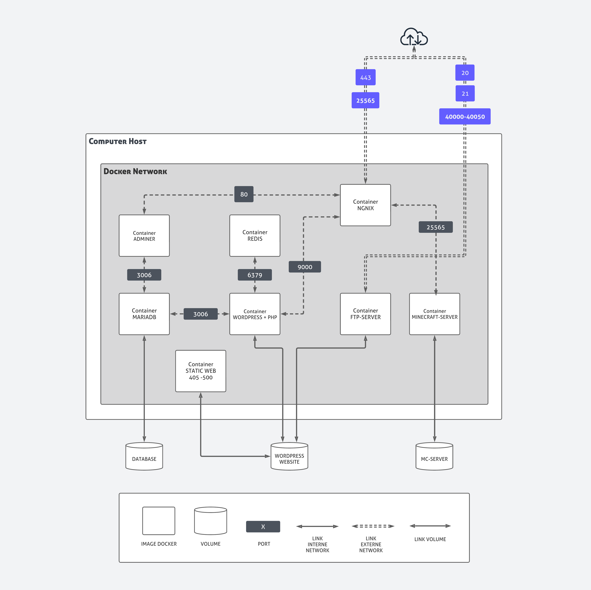

  <h3 align="center">Inception</h3>
  System administration exercise with Docker to manage and configure services
   
   

 

# Inception

Involves setting up Docker containers for NGINX, WordPress, and MariaDB in a virtual machine. The project focuses on building Docker images, using Docker Compose, and managing container security and persistence.

 

## How to run

- Make sure you have Docker and it is running.
- Go to root directory and run `make` to build all containers.

 

## Project Structure

   
   

