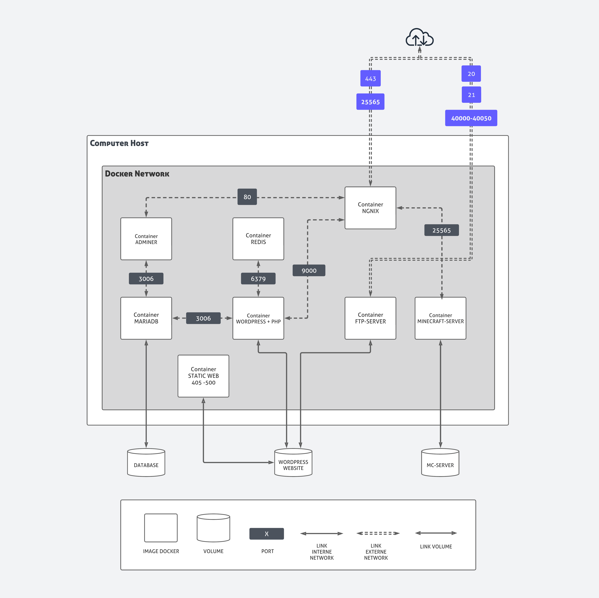

  <h3 align="center">Inception</h3>
  System administration exercise with Docker to manage and configure services
   

 

# Inception

Inception is a 42 system administration project that introduces containerization with Docker. The goal is to build a small infrastructure of services running inside a virtual machine, where each service lives in its own container and is wired together through Docker Compose.

The stack runs three services: **NGINX** as the only entry point (TLS on port 443), **WordPress** with PHP-FPM serving the site, and **MariaDB** as the database backend. All images are built from scratch using the penultimate stable version of Debian or Alpine — no pre-built images from Docker Hub are used for the three core services.

 

## Stack

- **NGINX** — reverse proxy, TLSv1.2 / TLSv1.3 only, sole exposed port (443).
- **WordPress + PHP-FPM** — application layer, communicates with NGINX over FastCGI.
- **MariaDB** — persistent database, isolated on the internal Docker network.
- **Docker Compose** — orchestrates the three services and their network.
- **Docker volumes** — bind-mounted to `/home/${USER}/data` for WordPress files and the MariaDB data directory, so state survives container restarts.

 

## How to run

- Make sure you have Docker installed and the daemon is running.
- From the project root, run `make` to build the images and bring the containers up in detached mode.
- Other useful targets:
  - `make clean` — stop containers and remove images and volumes created by the compose file.
  - `make fclean` — full clean: also wipes the bind-mounted data directories and prunes unused volumes.
  - `make re` — rebuild from a clean state.

 

## Project Structure

   
   

